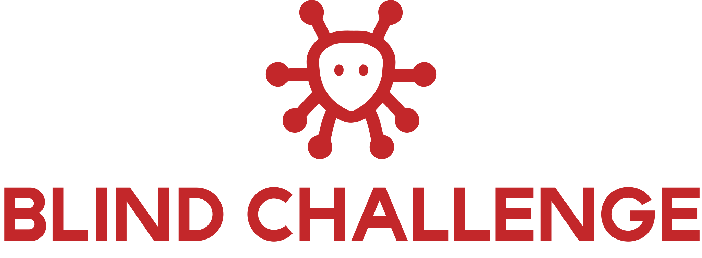
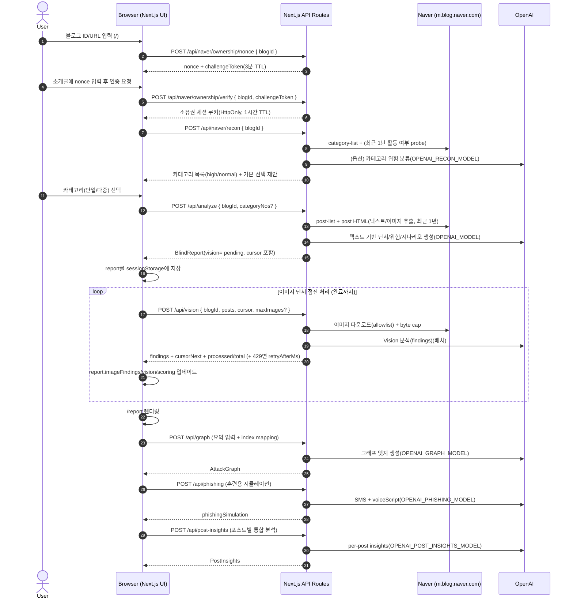
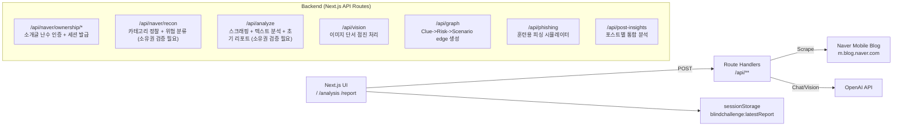

<p align="center">
  
</p>

Blind Challenge (블라인드 챌린지) MVP

네이버 블로그 챌린지(예: #블챌) 카테고리의 공개 글을 수집해 OSINT 관점의 위험 신호를 추출하고,
`단서 -> 위험 요소 -> 공격 시나리오` 흐름을 그래프로 시각화하는 보안 인식용 MVP입니다.

핵심 메시지: 블챌 참여자는 “포인트/이벤트”만 보지만, 공격자는 그 뒤의 디지털 풋프린트를 봅니다.

## 1. 프로젝트 개요 (Project Overview)

- 목표: 공개된 네이버 블로그 글(텍스트/이미지)에서 개인정보·생활패턴 노출 “단서”를 찾아내고, 이를 바탕으로 위험 요소(Risk)와 공격 시나리오(Scenario)를 *방어 목적*으로 설명합니다.
- 핵심 출력물: `Clue(단서) -> Risk(위험) -> Scenario(시나리오)` 그래프 + Evidence(근거) 탐색기 + 훈련용 피싱 시뮬레이션(SMS/대본).
- 저장 정책: 서버 DB 저장 없음. 분석 결과는 브라우저 `sessionStorage`의 `blindchallenge:latestReport`에만 저장됩니다.
- 소유권 검증: URL만으로 타인 블로그를 분석할 수 없도록, 소개글 난수 인증(3분 TTL) + 소유권 세션 쿠키(1시간 TTL)를 사용합니다.
- 안전/윤리: 범죄 실행을 돕지 않습니다. 출력은 PII를 그대로 노출하지 않도록 마스킹/축약을 적용하고, 피싱 시뮬레이터는 링크/계좌/전화번호/기관사칭 디테일을 금지합니다.

## Getting Started

### 1) 설치

```bash
npm i
```

### 2) 환경 변수

`.env.local`:

```bash
OPENAI_API_KEY=...
BLINDCHAL_OWNERSHIP_SECRET=... # 권장 (미설정 시 NEXTAUTH_SECRET/OPENAI_API_KEY 순으로 fallback)
```

선택(모델/튜닝):

```bash
# Text analysis model (default: gpt-4o-mini)
OPENAI_MODEL=gpt-4o-mini

# Category recon classifier model (default: gpt-4o-mini)
OPENAI_RECON_MODEL=gpt-4o-mini

# LLM graph model (default: gpt-4o-mini)
OPENAI_GRAPH_MODEL=gpt-4o-mini

# Phishing simulator model (default: gpt-4o)
OPENAI_PHISHING_MODEL=gpt-4o

# Per-post "insights" model (default: gpt-4o-mini)
OPENAI_POST_INSIGHTS_MODEL=gpt-4o-mini

# Progressive Vision batching (default: 12)
BLINDCHAL_VISION_MAX_IMAGES_PER_CALL=12

# Max image bytes when downloading for Vision (default: 1500000)
BLINDCHAL_MAX_IMAGE_BYTES=1500000
```

### 3) 실행

```bash
npm run dev
```

브라우저에서 `http://localhost:3000` 접속

## 2. 시스템 아키텍처 및 기술 스택

### Tech Stack

- : Next.js(App Router), React, TypeScript
- Styling/UX: Tailwind CSS, framer-motion, lucide-react
- Graph: React Flow(`reactflow`)
- Scraping/Parsing: `m.blog.naver.com` API + HTML parsing(cheerio)
- LLM: OpenAI Chat Completions(텍스트/그래프/피싱) + Vision(이미지 단서)
- State: 서버 DB 없음, 클라이언트 `sessionStorage` 중심
- Ownership Auth: 소개글 난수 인증 + `HttpOnly` 세션 쿠키 기반 분석 권한 부여

### Key Design Points

- API Route는 App Router의 Route Handler(`src/app/api/**/route.ts`)로 구현되어 있고,`runtime = "nodejs"`, `dynamic = "force-dynamic"`로 런타임/캐시를 고정합니다.
- 이미지 다운로드는 SSRF 완화를 위해 `*.pstatic.net` allowlist만 허용합니다(그 외 URL은 무시).
- Vision은 429(TPM) 리스크를 줄이기 위해 점진 처리(Progressive batching)로 동작합니다.

### 📊 System Flow (Sequence Diagram)



### 🏗 Architecture Overview



## 데모 플로우(심사용)

1. `/`에서 네이버 ID 또는 블로그 URL 입력
2. `/analysis`에서 챌린지 카테고리 후보를 자동 탐지하고 선택
3. 분석 완료 후 `/report`로 이동
4. `/report`에서 다음을 확인
   - 상단 임팩트 카드: "왜 지금 중요한가" (위험 신호 규모/상위 게시물 집중도)
   - `Top 위험 게시물`: 게시물별 점수 + 권장 조치(1~2개) 고정 노출, 클릭 시 근거로 스크롤
   - React Flow 그래프: `텍스트 단서/이미지 단서 -> 위험 -> 시나리오` 연결(LLM 그래프 우선)
   - 근거 탐색기: 단서 클릭 -> 해당 포스트/발췌/AI 근거 하이라이트
   - "나를 노리는 가상 피싱 문자": 훈련용 시뮬레이터(SMS + 보이스피싱 대본)

## 3. 상세 기능 요구사항 (Functional Requirements)

### 3.1 Target 입력 (/)

- 사용자는 네이버 blogId(예: `someid`) 또는 블로그 URL을 입력할 수 있어야 합니다.
- 입력값은 내부적으로 `blogId`로 정규화되어야 합니다.
- 분석 진입 전, 소유권 검증 단계가 필요합니다.
  - `/api/naver/ownership/nonce`로 3분 TTL 난수 발급
  - 사용자가 블로그 소개글에 난수를 입력/저장
  - `/api/naver/ownership/verify`로 난수 존재 여부 확인 후 세션 쿠키 발급
- 소유권 세션이 유효한 경우에만 `/analysis?blogId=...`에서 분석이 진행되어야 합니다.

### 3.2 Recon: 카테고리 정찰 (/analysis, `/api/naver/recon`)

- 시스템은 blogId의 카테고리 목록을 수집하고, (가능하면) 최근 1년 내 활동 카테고리만 후보로 남겨야 합니다.
- 각 카테고리는 OSINT 관점 위험도(high/normal)를 갖고, 기본 선택값은 `high 또는 챌린지 카테고리` 위주여야 합니다.
- 사용자에게 체크박스 UI로 다중 선택을 제공해야 합니다(접근 제한 카테고리는 비활성화).

### 3.3 Analyze: 텍스트 기반 분석 (/api/analyze)

- 선택된 카테고리(단일/다중)에서 최근 1년 공개 게시물을 수집해야 합니다(총량 cap).
- 게시물 텍스트에서 단서(ExtractedPiece)를 추출하고, 이를 설명 가능한 RiskNode/Scenario로 정리해야 합니다.
- 결과는 `BlindReport`로 반환되어 UI에서 Evidence 탐색이 가능해야 합니다(각 piece는 postUrl/logNo 기반 근거 포함).
- OpenAI 호출/네이버 수집이 실패해도 Mock 리포트로 폴백하여 데모가 끊기지 않아야 합니다(단, warnings로 표시).

### 3.4 Vision: 이미지 단서 점진 처리 (/api/vision)

- 게시물 이미지 URL을 다운로드하여 Vision 모델에 전달하고, PII를 직접 노출하지 않는 형태로 findings를 생성해야 합니다.
- 429(TPM) 발생 시 `retryAfterMs`로 재시도 타이밍을 안내해야 합니다.
- 진행 상태는 `vision: { status, processedImages, totalImages, cursor }`로 추적되어 중단 후 재개가 가능해야 합니다.

### 3.5 Report: 시각화/근거/훈련 (/report)

- Overview: 전체 위험도(riskScore)와 상위 위험 게시물(Top 위험 게시물)을 보여야 합니다.
- Graph: `단서 -> 위험 -> 시나리오`를 React Flow로 시각화해야 합니다.
  - LLM edge가 있으면 사용하고, 없으면 휴리스틱 그래프로라도 연결을 보여야 합니다.
  - Edge 클릭 시 연결 “근거(reason)”를 확인할 수 있어야 합니다.
- Evidence: 텍스트 단서/이미지 단서/포스트별 통합 분석(Post Insights)을 필터링/검색하며 탐색할 수 있어야 합니다.
- Training: 훈련용 피싱(SMS + 대본)을 제공하되, 안전 규칙(링크/기관사칭/송금유도 금지)을 지켜야 합니다.

### 3.6 Scoring

- 리포트에는 `scoring`이 포함되어야 하며, 포스트 단위 점수(`postScores`)와 breakdown을 제공해야 합니다.
- 최근 7일/30일 내 “단서가 존재하는” 게시물은 작은 가중치를 받아야 합니다.

## 4. 데이터 요구사항 (Schema Design)

### Core Object: `BlindReport`

분석 결과의 단일 스냅샷이며, UI는 이를 `sessionStorage`에 저장/갱신합니다.

```ts
// src/lib/types.ts
type BlindReport = {
  blogId: string;
  generatedAt: string; // ISO datetime

  contents?: ScrapedContent[]; // 수집된 포스트(텍스트/이미지 URL 포함)
  extractedPieces: ExtractedPiece[]; // 텍스트 단서 (evidence 포함)
  imageFindings?: ImageFinding[]; // Vision 단서 (postLogNo로 연결)

  riskNodes: RiskNode[];
  scenarios: Scenario[];

  attackGraph?: AttackGraph; // LLM edge(선택) + reason
  phishingSimulation?: {
    sms: string;
    voiceScript: string;
    model?: string;
    generatedAt?: string;
  };
  postInsights?: PostInsights; // 포스트별 통합 분석

  scoring?: ReportScoring; // 서버/클라에서 갱신되는 점수
  riskScore?: number; // 0..100 (scoring에서 계산)

  vision?: VisionMeta; // 점진 처리 상태
  category?: { categoryNo: number; categoryName: string }; // 단일 선택 호환
  categories?: Array<{ categoryNo: number; categoryName: string }>; // 다중 선택 메타
  source?: { scrapedAt: string; postCount: number };
  warnings?: string[];
};
```

### 관계(요약)

- `ScrapedContent(logNo)` 1개는:
  - `ExtractedPiece.evidence.logNo`로 텍스트 단서와 연결됩니다.
  - `ImageFinding.postLogNo`로 이미지 단서와 연결됩니다.
- `AttackGraphEdge`는 source가 `piece(index)` 또는 `image(index)` 또는 `risk(riskId)`이고, target이 `risk(riskId)` 또는 `scenario(scenarioId)`입니다.

### Vision 진행 상태

- `vision.cursor`는 `{ postIndex, imageIndex }`이며, `/api/vision` 호출 시 다음 배치 시작점을 의미합니다.
- `vision.status`는 `pending | partial | complete`입니다.

## 안전/윤리(의도)

이 프로젝트는 "범죄 실행"을 돕는 목적이 아니라,
사용자가 공개 글로 인해 발생할 수 있는 OSINT 위험을 인지하고 예방 조치를 하도록 돕는 데 초점을 둡니다.

- 결과 텍스트/이미지 요약은 PII를 그대로 노출하지 않도록 마스킹/축약을 적용합니다.
- 피싱 시뮬레이터는 링크/계좌/전화번호/송금 유도/기관 사칭을 포함하지 않도록 제한합니다.

## Vision(이미지 단서) 처리 방식

이미지 분석은 429(TPM) 방지를 위해 `/api/analyze`에서 한 번에 처리하지 않고,
`/analysis`에서 `/api/vision`을 반복 호출해 100% 완료 후 `/report`로 이동하는
“점진 처리(Progressive)”로 동작합니다.

## 5. API 명세 (Backend Endpoints)

> 모든 엔드포인트는 Next.js Route Handler이며 `Content-Type: application/json`을 사용합니다.

### Endpoint List

- `POST /api/naver/categories`: 챌린지 카테고리 후보/추천(간단)
- `POST /api/naver/recon`: 카테고리 정찰(최근 활동 필터 + 위험 분류 + 기본 선택)
- `POST /api/analyze`: 스크래핑 + 텍스트 분석 + 초기 리포트 생성(vision은 pending으로 시작)
- `POST /api/vision`: 이미지 단서 점진 처리(429 시 retryAfterMs 제공)
- `POST /api/graph`: `clue -> risk -> scenario` 엣지 생성(요약 입력 + index mapping 지원)
- `POST /api/phishing`: 훈련용 피싱 시뮬레이션 생성
- `POST /api/post-insights`: 포스트별 통합 분석 생성(vision complete 이후 권장)

### `POST /api/naver/categories`

요청:

```json
{ "blogId": "someid" }
```

응답(200):

```json
{
  "blogId": "someid",
  "categoryCount": 12,
  "candidates": [
    {
      "categoryNo": 1,
      "categoryName": "[블챌] ...",
      "postCnt": 3,
      "openYN": true
    }
  ],
  "recommendedCategoryNo": 1
}
```

### `POST /api/naver/recon`

요청:

```json
{ "blogId": "someid" }
```

응답(200):

```json
{
  "blogId": "someid",
  "cutoffDate": "YYYY-MM-DD",
  "asOfDate": "YYYY-MM-DD",
  "categoryCount": 24,
  "highRiskCount": 6,
  "defaultSelectedCategoryNos": [10, 20],
  "categories": [
    {
      "categoryNo": 10,
      "categoryName": "[블챌] 왓츠인마이블로그",
      "postCnt": 12,
      "openYN": true,
      "risk": "high",
      "riskReason": "…",
      "isChallenge": true
    }
  ],
  "warnings": []
}
```

### `POST /api/analyze`

요청:

```json
{
  "blogId": "someid",
  "mode": "live",
  "maxPosts": 10,
  "categoryNo": 123,
  "categoryNos": [123, 456]
}
```

노트:

- `mode: "mock"`이면 네이버/오픈AI를 호출하지 않고 mock 리포트를 반환합니다.
- `categoryNos`(다중)가 있으면 카테고리별 cap을 두고 전체 `maxPosts`(기본 10, 최대 20) 안에서 수집합니다.

응답(200): `BlindReport`

오류:

- `400`: `blogId` 누락
- `500`: 내부 오류(그 외 실패는 대부분 warnings 포함 mock으로 폴백)

### `POST /api/vision`

요청:

```json
{
  "blogId": "someid",
  "posts": [
    {
      "logNo": "123",
      "url": "...",
      "title": "...",
      "publishedAt": "2026-02-01",
      "images": ["https://..."]
    }
  ],
  "cursor": { "postIndex": 0, "imageIndex": 0 },
  "maxImages": 12
}
```

응답(200):

```json
{
  "findings": [
    {
      "postLogNo": "123",
      "imageIndex": 0,
      "severity": "high",
      "label": "...",
      "excerpt": "...",
      "rationale": "..."
    }
  ],
  "cursorNext": { "postIndex": 0, "imageIndex": 12 },
  "done": false,
  "processedImages": 12,
  "totalImages": 40
}
```

오류:

- `429`: `{ "error": "openai_vision_429", "retryAfterMs": 8000, "cursor": {..} }`
- `502`: OpenAI 실패/파싱 실패 등

### `POST /api/graph`

요청(요약 입력 + index mapping):

```json
{
  "blogId": "someid",
  "extractedPieces": [
    /* subset */
  ],
  "extractedPieceIndexes": [0, 3, 9],
  "imageFindings": [
    /* subset */
  ],
  "imageFindingIndexes": [1, 7],
  "riskNodes": [
    /* ... */
  ],
  "scenarios": [
    /* ... */
  ]
}
```

응답(200):

```json
{
  "generatedAt": "YYYY-MM-DDTHH:mm:ss.sssZ",
  "model": "gpt-4o-mini",
  "edges": [
    {
      "id": "e-1",
      "source": { "kind": "piece", "index": 3 },
      "target": { "kind": "risk", "riskId": "risk-1" },
      "strength": 0.82,
      "reason": "..."
    }
  ],
  "warnings": []
}
```

오류:

- `429`: `{ "error": "openai_graph_429", "retryAfterMs": 8000 }`
- `502`: OpenAI 실패/파싱 실패 등

### `POST /api/phishing`

요청:

```json
{
  "blogId": "someid",
  "extractedPieces": [],
  "imageFindings": [],
  "riskNodes": [],
  "scenarios": []
}
```

응답(200):

```json
{ "sms": "...", "voiceScript": "...", "model": "gpt-4o", "generatedAt": "..." }
```

오류:

- `429`: `{ "error": "openai_phishing_429", "retryAfterMs": 8000 }`
- `502`: OpenAI 실패/파싱 실패 등

### `POST /api/post-insights`

요청:

```json
{
  "blogId": "someid",
  "contents": [
    {
      "logNo": "123",
      "url": "...",
      "title": "...",
      "publishedAt": "2026-02-01",
      "categoryName": "..."
    }
  ],
  "extractedPieces": [],
  "imageFindings": []
}
```

응답(200): `PostInsights`

오류:

- `429`: `{ "error": "openai_post_insights_429", "retryAfterMs": 8000 }`
- `502`: OpenAI 실패/파싱 실패 등(가능하면 부분 결과로 계속 진행)

## 트러블슈팅

- `openai_vision_429` 또는 429가 자주 발생하는 경우
  - `BLINDCHAL_VISION_MAX_IMAGES_PER_CALL` 값을 낮추세요(예: 6~12).
  - `/analysis`에서 “이미지 단서 분석 중…” 상태가 잠시 대기 후 자동 재개되는지 확인하세요.
- 네이버 수집이 실패하는 경우
  - 비공개/성인인증/봇차단/구조 변경 가능성이 있습니다.
  - `/analysis` 단계에서 다른 후보 카테고리를 선택해 시도해 보세요.

## 개발 메모

- Next.js App Router 기반
- React Flow: 그래프 시각화
- cheerio: HTML 파싱(모바일 블로그)
